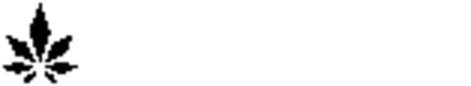
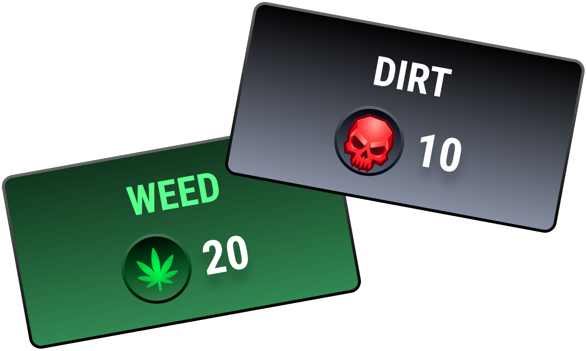

# DopeRaider

<figure><figcaption></figcaption></figure>

DopeRaider is a real-time on-chain multiplayer RPG about building an empire under pressure. Players grow WEED, mine DIRT, move product across seven districts, raid rivals, earn Respect, and fight for control of the street economy.

This is not a passive idle game. Every district has its own prices, bosses, risks, routes, and opportunities. You are managing working capital, inventory, time, protection, and reputation while other players are doing the same thing.


Cinematic trailer


## The Core Loop

| Step | What You Do | Why It Matters |
| --- | --- | --- |
| 1 | Buy SEEDS or EXPLOITS | Inputs are the start of your supply chain. |
| 2 | Grow WEED or mine DIRT | Production turns inputs into sellable product. |
| 3 | Watch district prices | Market gaps create profit windows. |
| 4 | Travel with product | Moving inventory creates upside and exposes risk. |
| 5 | Sell, raid, or defend | Profit comes from timing, protection, and nerve. |

<figure><figcaption>
Two product lines. One empire.
</figcaption></figure>

## Same Empire. Two Product Lines.

WEED is organic, street-level supply. DIRT is digital contraband: stolen data, leaked credentials, intercepted communications, scraped records, and other dangerous information abstracted into a tradeable in-game commodity.

| Product | Input | Production Verb | Unit | Style |
| --- | --- | --- | --- | --- |
| WEED | SEEDS | GROWING | units | grow rooms, bags, street supply |
| DIRT | EXPLOITS | MINING | GB | drives, servers, breaches, black briefcases |

DIRT is designed as a mirror of WEED mechanically. Carry capacity, prices, production time, trading, raids, busts, upgrades, and jackpot mechanics all follow the same risk-to-reward logic, but DIRT brings a hacker-side aesthetic and new lore surface.

## What This Book Covers

This GitBook is both field manual and world bible. It explains how to play, how the economy behaves, why DIRT exists, how raids resolve, what upgrades matter, how Respect is earned, and how players can approach the game strategically.


DopeRaider is a risk-to-earn game. You can make profitable decisions, but you can also lose inventory, fees, time, and position. Nothing here is financial advice or a promise of profit.

