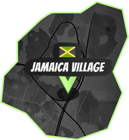

# Districts and Travel

The world is split into seven districts. Each district has its own market, boss race, local identity, travel exits, and strategic role.

<figure><figcaption><p>Profit lives between districts. Risk lives on the route.</p></figcaption></figure>

## Districts

| ID | District | Identity | Route Notes |
| --- | --- | --- | --- |
| 1 | Jamaica Village | WEED-friendly street economy and early supply routes. | Connected to Novo Moskovo, Vice Island, and Chinatown. |
| 2 | Novo Moskovo | Cold black-market territory with tight routes. | Connected to Little Italy, Vice Island, and Jamaica Village. |
| 3 | Little Italy | Dense, dangerous, and raid-heavy. | Connected to Novo Moskovo, Cartagena, and Vice Island. |
| 4 | Cartagena | High-heat territory and production pressure. | Connected to Vice Island, Little Italy, and Baltimore. |
| 5 | Baltimore | Docks, warehouses, and ambush opportunities. | Connected to Chinatown, Vice Island, and Cartagena. |
| 6 | Chinatown | Neon trade routes and premium DIRT flavor. | Connected to Jamaica Village, Vice Island, and Baltimore. |
| 7 | Vice Island | Central hub, dirty policing, LockUp pressure. | Connected to every other district. |

## Travel Types

Normal travel follows district exits. It is cheaper, but route-limited and exposed to bust risk.

Fast Travel lets you jump to any district for a higher fee. In current game rules it bypasses adjacency and the normal bust roll, so it is used when time, margin, or safety matters more than cost.

## Bust Risk

Travel can trigger a bust. If you are carrying enough product, a bust can confiscate part of your WEED and DIRT. Bust Protection reduces that risk.

The real cost of travel is not only the fee. It is:

```text
travel cost + bust risk + raid exposure + time + lost market opportunity
```

## Route Planning

Before moving, check:

* current district buy price
* target district sell price
* how much product you can carry
* whether a production job is reserving capacity
* whether you need Bust Protection or Safe House time
* whether raiders are active in the target district

## Strategic Principle

Small moves teach the map. Large moves should be protected.

When a run has real margin, pay for the cover that keeps it alive.
