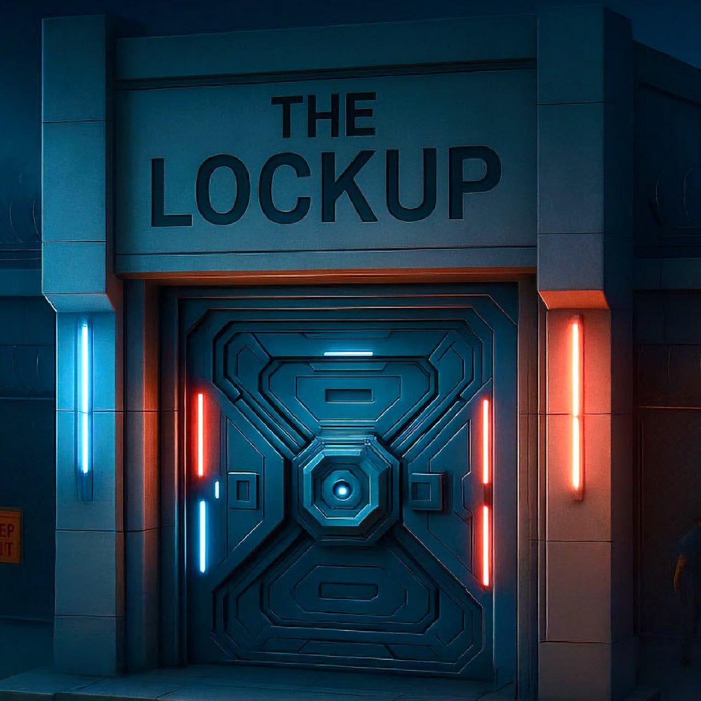

# Raiding

<figure><figcaption></figcaption></figure>

Raiding is a core pillar of DopeRaider gameplay, introducing high-risk, high-reward mechanics that reward strategy, aggression, and timing. It allows players to directly target and profit from others, adding a competitive, predatory layer to the economy.

#### The Role of Raiding in the Economy

Raiding is more than a way to steal product and currenc it shapes the game’s economic balance:

* **Product Seizure**: Successful raids remove product from the target and transfer it to the raider, disrupting production and trade cycles.
* **Market Influence**: Large-scale raiding reduces available product in district markets, creating scarcity and price spikes.
* **Progression Impact**: Raids slow competitors' progression by limiting their income and resources.

Skilled raiders use information, timing, and upgrades to create opportunities and extract maximum profit with minimal risk.

How Raiding Works

Raiding is available both **online** (when players are actively engaged) and **offline** (when players are inactive), ensuring constant risk and opportunity.

**The mechanics of a raid include**:

* Raiders locate potential targets carrying product or currency.
* An attack is initiated, with success determined by several factors:
  * **Raid Power Upgrades**: Temporary boosts that increase a raider's chance of victory.
  * **Raid Protection Upgrades**: Defenses that reduce a player's risk of being successfully attacked.
  * **Travel Busts**: Specific moments during player travel where ambush opportunities arise, making movement between districts dangerous without preparation.
* If the raid succeeds, the raider seizes a portion of the target's product and currency.
* All raids contribute to the raider's **Respect**, influencing their progression and status within the game.

<figure><figcaption></figcaption></figure>

Strategic Raiding

Effective raiding requires more than aggression it demands planning and situational awareness:

* **Target Selection**: Smart raiders focus on vulnerable or high-value players to maximize profits.
* **Upgrade Timing**: Applying Raid Power boosts at the right moment dramatically increases success rates.
* **Defensive Considerations**: Even aggressive players must invest in Raid Protection to defend their own assets from counterattacks.
* **Market Awareness**: By timing raids during periods of high product movement, raiders can intercept significant hauls and manipulate market supply.

#### Raid Outcomes & Tie Rules

Combat outcomes in raids are determined by weapon matchups following a simple hierarchy:

&#x20;Rifle beats Shotgun

&#x20;Shotgun beats Pistol

&#x20;Pistol beats Rifle

In the event of a tie, where both players use the same weapon, the winner is determined by Respect, with the player holding the higher total winning the encounter. A special upgrade, Raid Tie Breaker (RTB), will  allow the player who holds it to win tie situations automatically, regardless of respect. If both raiders have an active Raid Tie Breaker, the raider with the highest Raid Tie Breaker upgrade tier wins. If both raiders have the same RTB upgrade tier, then the player with the most respect wins.

Risk and Consequences

While raiding offers lucrative rewards, it carries inherent risks:

* Failed raids can result in wasted upgrades and resources.
* Repeated aggression may draw attention from other raiders or coordinated retaliation.
* Over-reliance on raiding without balancing production and trade limits long-term economic growth.
* If a player wins a raid but receives no product, it's likely because their **carry capacity is full,** players must have available space to collect stolen goods.
* Players must hold at least **2 weed** and **2 GB of DIRT** in order to initiate a raid.
* This requirement ensures that only active participants with resources at stake can raid, maintaining fairness and balance within the economy.

Only players who combine tactical aggression with broader economic strategy will thrive in the dangerous world of DopeRaider.

The LockUp

<figure><figcaption></figcaption></figure>

The LockUp is a police vault at Vice Island where 50% of all confiscated weed and DIRT are stored. This means the LockUp continuously grows as players are busted on their travels.

The "jackpot" can be won by successfully raiding the LockUp, although it's not easy.

Raiding the LockUp:

When a player chooses to raid the lockup, there will be a 1:30 chance of success.
\
When a player wins, they see the vault opening video, are notified by message and automatically receive their rewards.

A player can win up to 50% of the weed and DIRT stored in the LockUp even if it exceeds their current carry capacity.

The player must sell off their excess dope before being able to buy supplies or dope on district markets.

When a player wins the "jackpot" they also automatically receive raid and bust protection to prevent foul play from others players that might want to raid them afterwards.

The Path to Power

Raiding is not just about short-term profit  it is a pathway to dominance:

* The most feared raiders build reputations that deter competitors and grant status.
* Raiding success accelerates Respect accumulation, unlocking trophies, titles, and access to exclusive game features.
* Coordinated raiding, especially as part of future **cartel** systems, enables players to disrupt markets, control product flow, and shape the in-game economy.

In DopeRaider, the strongest players are not just producers or traders  they are those who master all elements, with raiding as their sharpest weapon.

