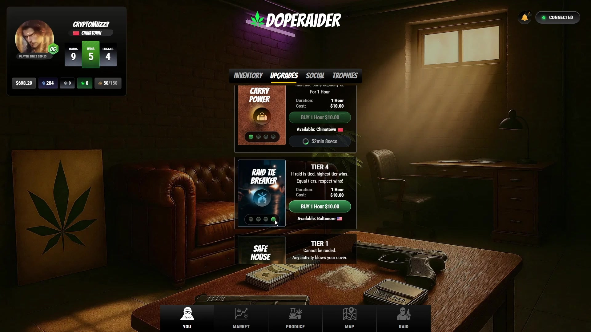
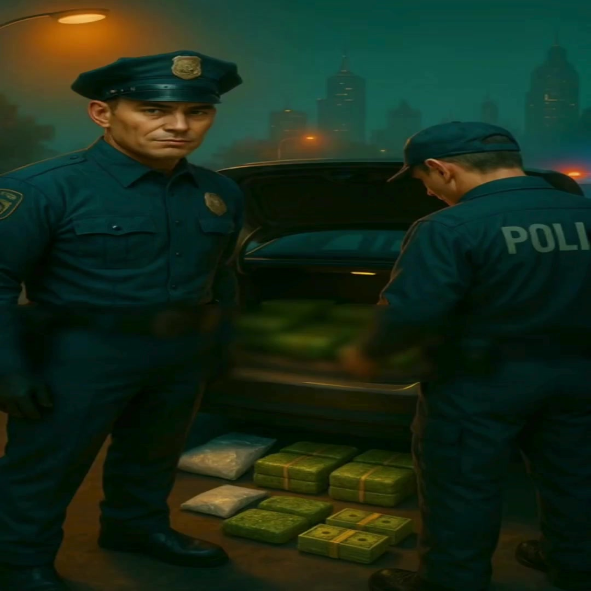
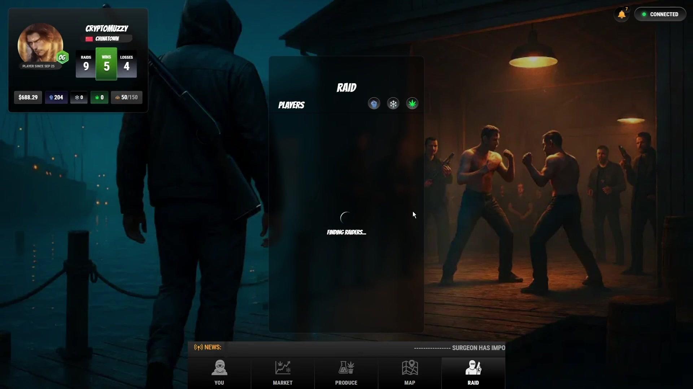

# Upgrades and Trophies

Earn Respect and competitive advantage in DopeRaider through two interconnected systems: **Upgrades** (temporary, strategic boosts) and **Trophies** (long-term achievements and status).

Together, these systems ensure that success in DopeRaider is earned through skill, timing, and smart decision-making, rather than simple financial investment.

<figure><figcaption></figcaption></figure>

## Upgrades

Upgrades are **temporary boosts** that help you specialize your playstyle (production, trading, or raiding). They’re designed to reward timing and strategy — not permanent wallet advantages.

<figure><figcaption>
Buying an upgrade
</figcaption></figure>

### How upgrades work

* Upgrades are **time-limited** (they expire).
* You can **stack** upgrades to build a strategy window (e.g., carry + bust protection for a trade run).
* Different upgrades matter in different phases: travel, raids, and production loops.

### Upgrade types

**Raid Power**
* Boosts your offensive edge in raids.

**Raid Protection**
* Helps protect you from being successfully raided.

**Bust Protection**
* Helps protect you from losing dope during travel busts.

<figure><figcaption>
Bust protection helps reduce travel risk
</figcaption></figure>

**Grow Power**
* Speeds up weed growing cycles.

**Mining Power**
* Speeds up DIRT mining cycles.

**Carry Capacity**
* Increases how much you can carry, enabling higher-volume moves.

### Quick strategy examples

* **Trader run:** Carry Capacity + Bust Protection
* **Aggressive raider:** Raid Power + Raid Protection
* **Producer grind:** Grow Power + Mining Power

<figure><figcaption>
Upgrades used to set up raids
</figcaption></figure>

## Trophies: Long-Term Progression and Status

While upgrades offer short-term advantages, **Trophies** represent a player's long-term achievements, reputation, and mastery within the DopeRaider world.

At the core of progression is **Respect**, the primary metric earned through all in-game activities:

* Production
* Trading
* Raiding
* Participation in events and competitions

As players accumulate Respect, they unlock:

* **Profile Upgrades**: Visual customizations and status indicators.
* **Titles**: Recognizable ranks that signal skill and achievement to the community.
* **Trophies**: Collectible, prestigious badges of honor that showcase a player's dedication and success.

#### Trophy Progression:

Trophies are organized into progressive tiers, reflecting increasing levels of achievement:

* **Boss**
* **Master**
* **Supremo**

These titles aren't cosmetic they are social markers within the game, commanding respect, opening doors to exclusive content, and establishing a player's reputation among allies and rivals alike.
