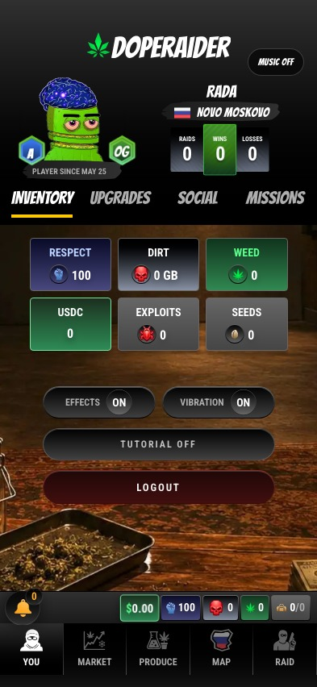

# Media Gallery

DopeRaider is designed to feel like a playable crime-world interface: heavy contrast, neon greens, DIRT reds, loud typography, cinematic districts, and UI that feels like a field console.

## Trailer


DopeRaider cinematic trailer


## Production

<figure><figcaption>
WEED and DIRT production share the same risk logic with different flavor.
</figcaption></figure>

## Inventory and Upgrades

<figure><figcaption>
The profile and inventory pane is the player's street identity.
</figcaption></figure>

<figure><figcaption>
Timed upgrades create short tactical windows.
</figcaption></figure>

## Raid Cinematic

<figure><video src=".gitbook/assets/raid-italy.mp4" controls poster=".gitbook/assets/raid-italy-poster.jpg"></video><figcaption>
Raid animation: Little Italy.
</figcaption></figure>

## District Arrival

<figure><video src=".gitbook/assets/little-italy-arrival.mp4" controls poster=".gitbook/assets/little-italy-arrival-poster.jpg"></video><figcaption>
Arrival clips give each district its own atmosphere.
</figcaption></figure>

## LockUp Jackpot

<figure><video src=".gitbook/assets/lockup-success.mp4" controls poster=".gitbook/assets/lockup-success-poster.jpg"></video><figcaption>
The LockUp is not only a mechanic. It is a cinematic payoff.
</figcaption></figure>

## Visual Language

| Element | Direction |
| --- | --- |
| WEED | green, organic, grow-room supply |
| DIRT | red, skull, exploit, drive, data-vault energy |
| Respect | blue/purple status cards, rank pressure |
| Districts | cinematic city identity, danger, arrival clips |
| UI | high contrast, hard shadows, condensed type, Bangers-style headlines |

Future GitBook updates should continue using actual in-game screenshots and cinematic media rather than generic marketing art.
