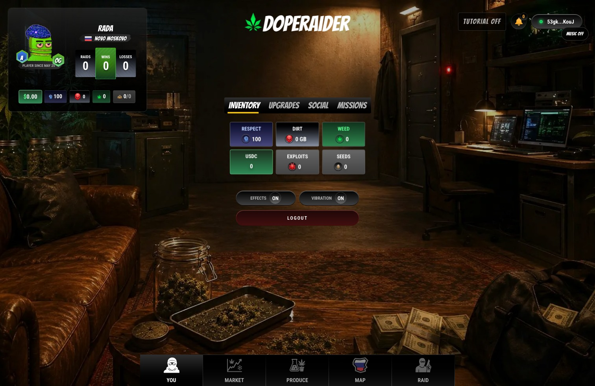

# Missions, Airdrops, and Referrals

Missions, airdrops, and referrals give players more ways to build momentum beyond the core market loop.

<figure><figcaption>
The inventory hub connects upgrades, social, missions, and progression.
</figcaption></figure>

## Missions

Missions are objectives that reward active play and teach the economy.

Mission categories can include:

* travel goals
* raid starts and raid wins
* grow completions
* DIRT mining targets
* sales goals
* weekly progress objectives

Daily missions keep players moving. Weekly missions reward deeper strategy.

## Season Pass

Season content can add mission tracks, rewards, competition hooks, and limited-time objectives. A season should feel like a campaign across the economy, not just a checklist.

## Airdrops

Airdrops help players enter the loop or reward meaningful participation.

Possible airdrop contents:

* SEEDS
* EXPLOITS
* WEED
* DIRT
* USDC support for testing or events
* special access items
* seasonal rewards

Airdrops matter because they create liquidity and action. A player with fresh inputs can produce. A player with product becomes a trader or a target.

## Referrals

Referrals reward players who bring active users into the economy.

The referral loop:

1. Get your invite link from the Social / Referrals area.
2. Share it with a new player.
3. The referred player joins and plays.
4. Eligible fee activity can generate referral earnings.

Referral income depends on actual activity. Empty signups do not build an empire. Active crews do.

## Community Strategy

DopeRaider is easier to learn with allies:

* one player watches markets
* one player produces
* one player scouts raid traffic
* one player tracks upgrade availability
* everyone shares district intel

The game is competitive, but information travels faster in a crew.
