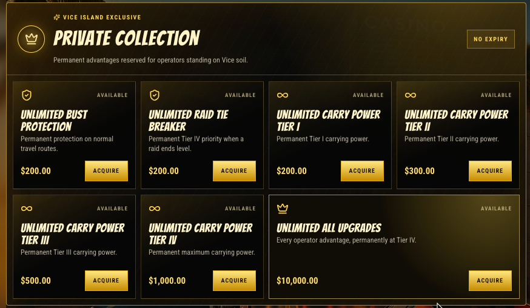

# Premium Upgrades

Premium Upgrades are permanent advantages from the **Private Collection** in **Vice Island**. They are for players who would rather make one premium purchase than keep renewing timed upgrades.

<figure><figcaption>
The Vice Island Private Collection offers upgrades with no expiry.
</figcaption></figure>

## Available only in Vice Island

Travel to **Vice Island** and open the **Private Collection** to view Premium Upgrades. The collection is not available in other districts.

## Permanent, with no renewal

Standard upgrades are temporary: they have a timer and need to be renewed when they expire. Premium Upgrades have **no expiry**. Once acquired, the advantage stays active without another renewal.

They come at a premium price because they remove that repeat-renewal step. Choose them if you want lasting access to advantages such as protection, raid tie-breaking, or carrying power instead of managing timers.

The live Private Collection screen is the source of truth for the Premium Upgrades currently available and their prices.
