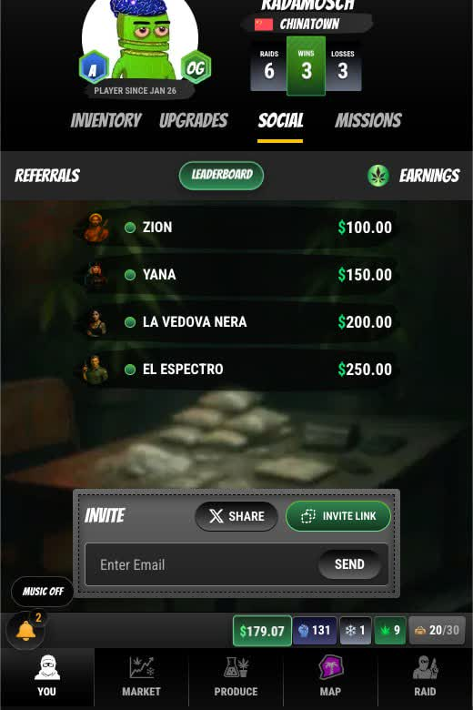

# Economy

<figure><figcaption></figcaption></figure>

The DopeRaider economy is a fully player-driven, decentralized system where production, trade, and raiding intertwine to create dynamic, real-time market conditions.

#### USDC (in-game currency)

**USDC** is DopeRaider’s in-game currency. Players use USDC to travel, buy product, produce dope, purchase upgrades, and raid other players.

**How to get USDC**

* **Connect a wallet with USDC** to fund gameplay.
* **Earn more USDC through gameplay** by producing, trading, raiding, and collecting eligible referral rewards.

This makes the economy high-stakes: gains and losses are real, and player decisions directly impact outcomes. If you finish with more USDC than you started with, you have made real in-game profit with real-world value.

#### Risk, Reward, and Player Control

Economic success in DopeRaider comes with risk:

* Producers and traders must guard their product from raiders.
* Raiders face resistance and potential losses if poorly timed.
* Market conditions can shift rapidly, rewarding those who adapt and punishing those who don't.

#### Referrals

Invite friends to DopeRaider and earn rewards when they play.

<figure><figcaption>
Referrals screen
</figcaption></figure>

**How it works**

* When someone joins through your referral, you can earn a share of the fees generated by their in-game activity.
* Your referral earnings accumulate over time and are visible in the Referrals screen.

**How to get your referral link**

1) Go to **Social → Referrals**
2) Tap **Invite Link**
3) Share the link (or use the Share button)

**How much can you earn?**

Referral earnings are based on fees generated through gameplay activity. The exact amounts will vary depending on how active your referrals are.

#### The LockUp (confiscated dope)

When a player is busted during travel, the game confiscates some dope.

* Confiscation reduces the player’s inventory.
* Half of the confiscated dope is transferred to a special on-chain address (the **Confiscated Dope** address).

This creates a pool of seized dope that can be used for LockUp/impound mechanics (see Raiding for more context).

Unlike traditional games, the DopeRaider economy is real, competitive, and shaped entirely by its players. Those who master production efficiency, market strategy, and calculated risk-taking will emerge as the wealthiest and most powerful figures in the game.
