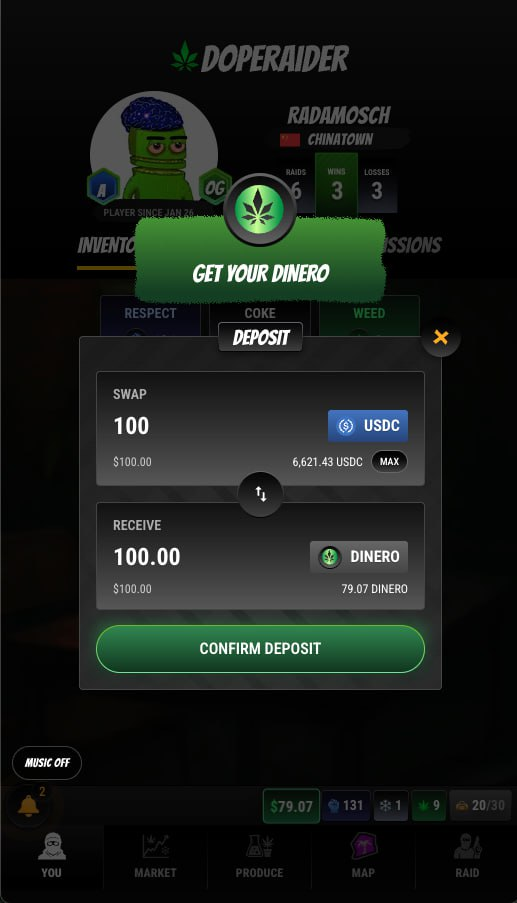

# Economy

<figure><figcaption></figcaption></figure>

The DopeRaider economy is a fully player-driven, decentralized system where production, trade, and raiding intertwine to create dynamic, real-time market conditions.

#### DINERO (in-game currency)

**DINERO** is DopeRaider’s in-game currency. It is designed to be **strictly backed 1:1 by USDC** (deposit USDC → receive DINERO, withdraw DINERO → receive USDC).

**How to get DINERO**

* **Deposit USDC** in the game to mint DINERO 1:1.
* **Earn it through gameplay** (production/trading/raiding payouts are denominated in the game currency).

<figure><figcaption>
Deposit USDC to receive DINERO
</figcaption></figure>

This makes the economy high-stakes: gains and losses are real, and player decisions directly impact outcomes.

#### Risk, Reward, and Player Control

Economic success in DopeRaider comes with risk:

* Producers and traders must guard their product from raiders.
* Raiders face resistance and potential losses if poorly timed.
* Market conditions can shift rapidly, rewarding those who adapt and punishing those who don't.

#### Referrals

Players can invite others into the game through a referral system.

* A player can have a **referrer** set on-chain.
* When a player generates revenue through in-game activities that charge fees, a **portion of the dev fee** is paid out to their referrer.
* Current rule (contracts): the referrer receives **10% of the dev fee** on that activity (if a referrer is set).

This incentivizes organic community growth while rewarding players who bring in active players.

#### The LockUp (confiscated dope)

When a player is busted during travel, the game confiscates some dope.

* Confiscation reduces the player’s inventory.
* Half of the confiscated dope is transferred to a special on-chain address (the **Confiscated Dope** address).

This creates a pool of seized dope that can be used for LockUp/impound mechanics (see Raiding for more context).

Unlike traditional games, the DopeRaider economy is real, competitive, and shaped entirely by its players. Those who master production efficiency, market strategy, and calculated risk-taking will emerge as the wealthiest and most powerful figures in the game.
