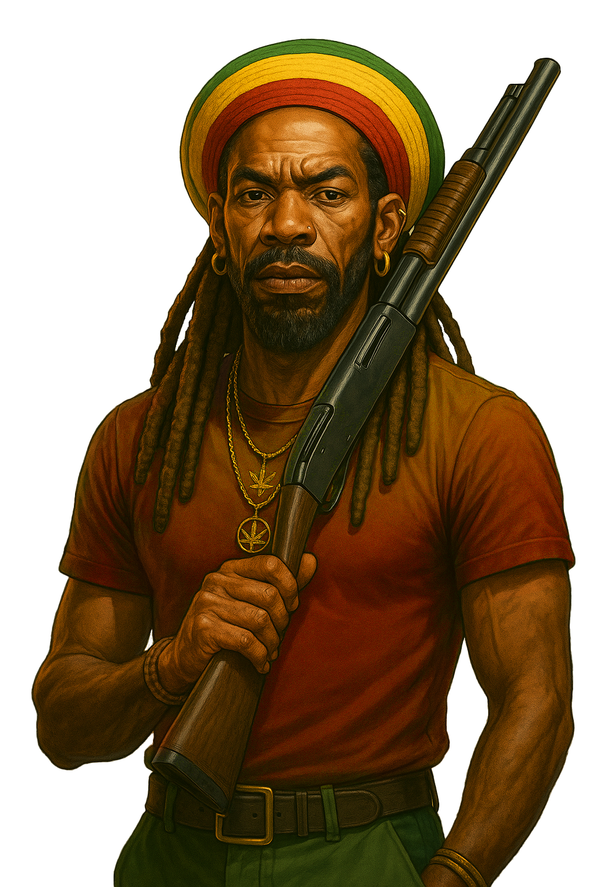

# Player Roles

<figure><figcaption></figcaption></figure>

**Producer**

Producers grow weed and mine DIRT to generate product. Success depends on managing time, resources, and upgrades to maximize yield. Producers supply the markets, influencing prices and driving the economy.

**Trader**

Traders buy and sell product across the seven districts, exploiting price fluctuations created by player activity. Smart traders monitor market conditions, optimize travel routes, and build wealth by timing their moves.

**Raider**

Raiders target other players for profit. By ambushing rivals, they can seize product and currency, disrupting supply chains. Raiding carries risk successful players balance aggression with protection.

Combining All Three

The most successful players master all three roles:

* Produce efficiently to control supply.
* Trade strategically for maximum profit.
* Raid opportunistically to weaken competitors and boost income.

Mastery of production, trading, and raiding enables players to dominate the DopeRaider economy.
