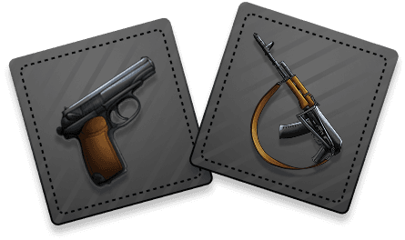

# Raiding and the LockUp

Raiding is DopeRaider's sharp edge. It turns other players into opportunities and makes every loaded route feel dangerous.

<figure><figcaption>
Raiders do not wait for permission. They wait for exposure.
</figcaption></figure>

<figure><video src=".gitbook/assets/raid-italy.mp4" controls poster=".gitbook/assets/raid-italy-poster.jpg"></video><figcaption>
Raid animation: Little Italy.
</figcaption></figure>

## How Raids Work

A raid targets another player in the same district. The raider pays a fee, a stake is created, and the encounter resolves through the raid system.

Raids can transfer:

* WEED
* DIRT
* Respect
* stake value

If you win but your inventory is full, you may not be able to collect all stolen product. Capacity matters even when you are attacking.

## Raid Requirements

The game uses minimum holdings to keep raids meaningful. A DIRT raid requires the player to hold at least 2 GB of DIRT, parallel to the existing 2-unit product rule.

Raid targets can be protected by:

* Raid Protection
* Safe House / Hideout effects
* careful timing
* not carrying value through crowded districts

## Weapon Matchups

Raids use a simple weapon triangle:

| Weapon | Beats |
| --- | --- |
| Rifle | Shotgun |
| Shotgun | Pistol |
| Pistol | Rifle |

If both sides choose the same weapon, the tie breaks by Respect unless Raid Tie Breaker changes the outcome.

## Raid Tie Breaker

Raid Tie Breaker is a temporary upgrade for tie situations. Higher tiers are stronger. If both players hold equal tie-breaker power, Respect becomes the deciding force again.

This makes Respect more than a number on a profile. It can settle fights.

## The LockUp

The LockUp is the police vault at Vice Island. It grows when product is confiscated during busts.

<figure><video src=".gitbook/assets/lockup-success.mp4" controls poster=".gitbook/assets/lockup-success-poster.jpg"></video><figcaption>
Vault-open cinematic for a successful LockUp hit.
</figcaption></figure>

Players can raid the LockUp for a jackpot chance. A successful hit can award a large share of stored product, even beyond normal carry capacity. When that happens, the winner needs to sell down before making normal market moves again.

## The Archive

The DIRT-side mirror of the LockUp is The Archive: a vault of seized data. The Archive concept follows the DIRT lore:

* busted DIRT feeds a data vault
* raiders can attempt a jackpot
* a jackpot can overfill normal drive capacity
* temporary Encryption and Firewall protection can shield the winner after a big score

Whether the LockUp and Archive are presented as one combined vault or two separate vaults can evolve by season, but the player-facing fantasy is clear: seized value does not disappear. It waits for someone reckless enough to hit the vault.

## Raider Strategy

Good raiders:

* hunt in districts with active trade traffic
* watch for players carrying product after production windows
* keep capacity open before attacking
* use Raid Tie Breaker before a planned streak where ties can decide the outcome
* carry protection after a win
* avoid wasting fees on protected targets

The best raid is not the loudest one. It is the one that lands when the target has the most to lose.
