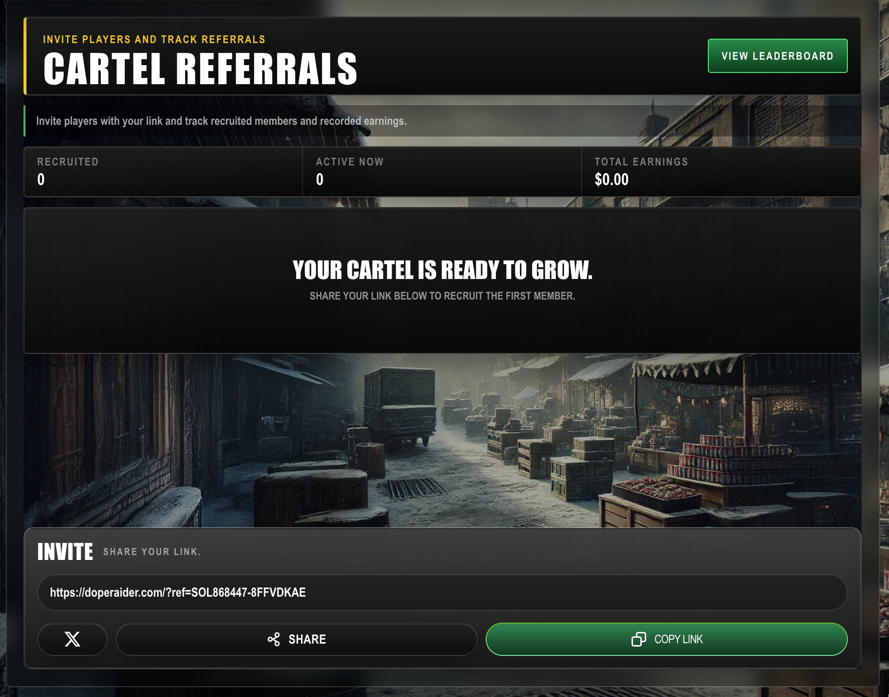

# Share & Earn

Invite players to DopeRaider and receive a **10% rebate on the turnover they create through their activity**. Your referral link tracks the players you bring in, and the rebate continues **in perpetuity** while they play.

<figure><figcaption>
Your Cartel Referrals screen shows your link, recruited players, activity, and total referral earnings.
</figcaption></figure>

## How it works

1. Open **Cartel Referrals** in the game.
2. Copy your personal referral link or use the **Share** button.
3. A new player joins through your link.
4. Their activity is linked to you.
5. You receive a rebate equal to **10% of their turnover**.

There is **no purchase required**. A player who joins with your link becomes your referral without needing to buy anything first.

The relationship does not run out. Once a player has joined through your link, their activity continues to generate your 10% referral rebate in perpetuity.

### A simple example

If the players who joined through your link create $100 of turnover, your referral rebate is $10. The more active your referred players are, the more your total referral rebate can grow.

## Get your referral link

Open the **Cartel Referrals** screen to find your personal link in the **Invite** section. You can:

* Select **Copy Link** to copy it to your clipboard.
* Select **Share** to send it directly from your device.
* Select the **X** button to share it on X.

Your link includes your unique referral code. Share that exact link so new players are connected to you when they join.

## Share it everywhere

Put your link where people will see it: X, Discord, Telegram, TikTok, Instagram, YouTube descriptions, gaming communities, group chats, and your own social posts. Invite people who will actually play—active referrals are what create turnover and referral rebates.

You can also use the **Cartel Referrals** screen to see:

* how many players you have recruited;
* how many are active now; and
* your total referral earnings.

## Your bonus is automatic

You do not need to claim anything, fill out a form, or request a payout. Your referral bonus is automatically sent to the wallet connected to your DopeRaider account.

Share your link, bring in players, and let the system do the rest.
