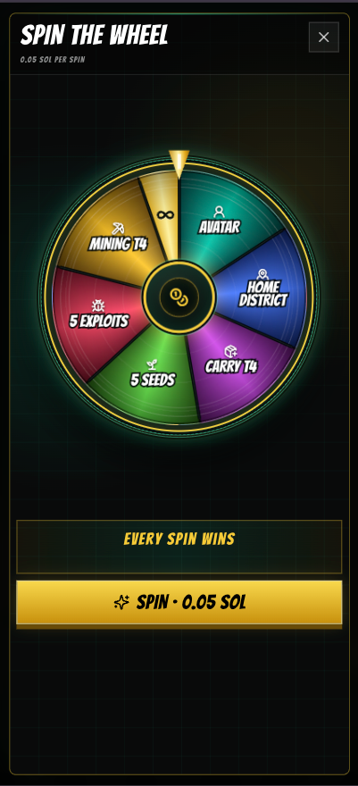

# Spin the Wheel

**Spin the Wheel** gives every player a prize. Each spin costs **0.05 SOL**.

<figure><figcaption>
Every spin wins a prize.
</figcaption></figure>

## How it works

1. Open **Spin the Wheel** in the game.
2. Confirm the **0.05 SOL** payment in your connected wallet.
3. Spin the wheel.
4. Your prize is added to your account or unlocked for you to use.

Every spin wins. The wheel shows the prize you receive when it stops.

## The prizes

| Prize | What you get |
| --- | --- |
| **Avatar Choice** | One unlock to change your avatar in Profile Edit. |
| **Home District Change** | One unlock to change your home district in Profile Edit. |
| **Carry Power Tier 4** | Maximum Carry Power for one hour. |
| **5 Seeds** | Five Seeds delivered to your reward inventory. |
| **5 Exploits** | Five Exploits delivered to your reward inventory. |
| **Mining Power Tier 4** | Maximum Mining Power for one hour. |
| **Permanent Carry Tier 4** | A permanent Tier 4 Carry Power prize. |

## Changing your avatar or home district

The wheel is the **only way** to unlock a change to your avatar or home district. Winning **Avatar Choice** or **Home District Change** gives you one change. Then open **Profile Edit** and use the unlock to make your selection.

These changes are not available as normal profile settings. If you want a new avatar or a different home district, Spin the Wheel is the route.

## Before you spin

Make sure your connected wallet has at least **0.05 SOL** available for the spin. Check the prize screen, confirm the payment in your wallet, and the game will apply the prize after the wheel stops.
