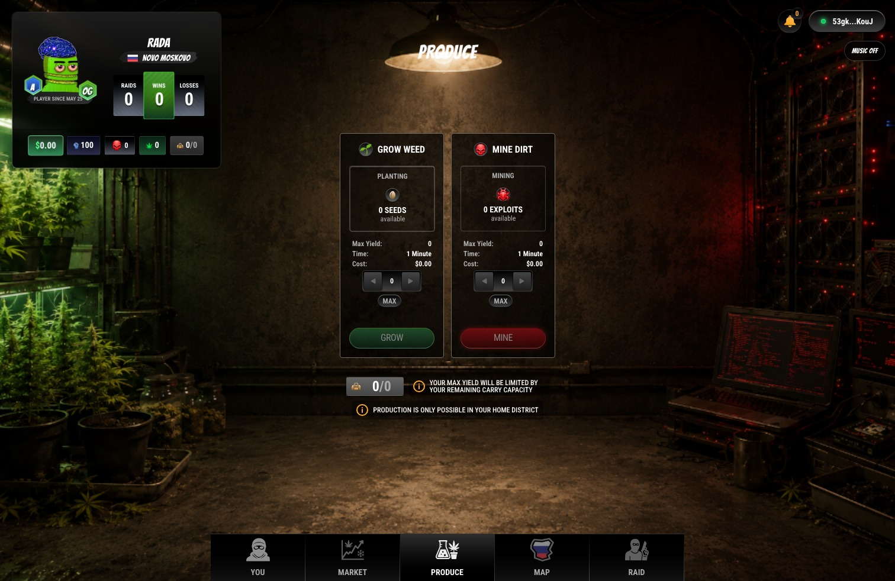

# Markets and Trading

Trading is the cleanest expression of the DopeRaider economy: buy where supply is cheap, move through danger, and sell where demand pays.

<figure><figcaption><p>Market prices, inventory, and district context drive every trade.</p></figcaption></figure>

## What Markets Sell

District markets can sell:

* WEED
* DIRT
* SEEDS
* EXPLOITS

SEEDS and EXPLOITS are inputs. WEED and DIRT are finished product.

## Buy Low, Sell High

The simple version is easy:

```text
profit = sell value - buy cost - input cost - production fee - travel cost - losses
```

The hard version is reading the risks before someone else does.

## Market Forces

Prices are shaped by:

* district supply
* local pool value
* player buying
* player selling
* production output
* raids
* busts and confiscation
* boss tax

If a district has too much product, prices can soften. If product gets removed through selling pressure, raids, or busts, scarcity can create opportunity.

## Selling Rules

Selling is a route game. You cannot simply produce at home and dump everything in the same place. Selling outside your home district pushes players onto the map, where travel risk and raiding matter.

## Product Units

| Product | Display |
| --- | --- |
| WEED | units |
| DIRT | GB, with high-tier lore using TB |

In player-facing inventory, DIRT is primarily shown in GB for consistency.

## Trader Strategy

Smart traders:

* compare district prices before buying
* calculate total route cost, not just market spread
* keep capacity open for unexpected gains
* use Bust Protection on heavy moves
* avoid carrying high-value product through obvious raid zones
* sell before protection expires

## Common Mistakes

* buying because a price looks cheap without checking sell exits
* spending all USDC and leaving no travel budget
* filling capacity before collecting production
* ignoring boss tax
* traveling with too much product and no protection
* chasing a price after the market has already moved

The best traders move before the obvious route becomes crowded.
