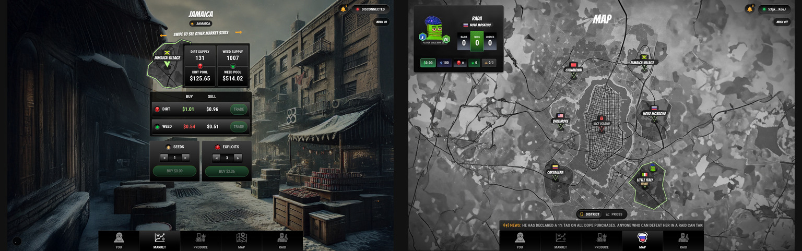

# Markets and Trading

Trading is the cleanest expression of the DopeRaider economy: buy where supply is cheap, move through danger, and sell where demand pays.

<figure><figcaption><p>Market prices, inventory, and district context drive every trade.</p></figcaption></figure>

## What Markets Sell

District markets can sell:

* WEED
* DIRT
* SEEDS
* EXPLOITS

SEEDS and EXPLOITS are inputs. WEED and DIRT are finished product.

## Arbitrage: Route the Spread

Arbitrage is the trader's core edge. Every district can price WEED, DIRT, SEEDS, and EXPLOITS differently. If one district lets you buy low and another district lets you sell high, the gap becomes a route opportunity.

<figure><figcaption><p>Arbitrage starts on the market screen, then becomes a travel decision.</p></figcaption></figure>

The basic read is:

```text
expected profit = destination sell value - origin buy cost - travel cost - fees - expected losses
```

The spread is only real after costs. A DIRT price gap can look profitable until you add travel, boss tax, bust exposure, raid risk, and the time it takes to reach the exit market. A smaller spread on a safer route can beat a bigger spread through a hot district.

Good arbitrage players:

* check DIRT and WEED buy/sell prices before moving
* keep enough USDC for travel after buying inventory
* use Bust Protection when the carried value justifies it
* avoid filling capacity so tightly that raid or jackpot rewards are wasted
* sell before the market moves or other players crowd the same route

Timing matters. If you buy before demand spikes, move while protection is active, and sell before supply floods the destination, the same inventory can turn into profit. If you wait too long, the spread can disappear while you are still on the road.

## Buy Low, Sell High

The simple version is easy:

```text
profit = sell value - buy cost - input cost - production fee - travel cost - losses
```

The hard version is reading the risks before someone else does.

## Market Forces

Prices are shaped by:

* district supply
* local pool value
* player buying
* player selling
* production output
* raids
* busts and confiscation
* boss tax

If a district has too much product relative to its pool, prices can soften. Travel, raid settlement, and busts can remove product from a district and create scarcity; a sale pays from the local pool while removing matching supply, so its exact price effect depends on the live balance. Read the refreshed quote instead of assuming that any one sale will move the market in a fixed direction.

For the full supply-and-liquidity model, see [Economy](economy.md).

## Selling Rules

Selling is a route game. You cannot simply produce at home and dump everything in the same place. Selling outside your home district pushes players onto the map, where travel risk and raiding matter.

## Product Units

| Product | Display |
| --- | --- |
| WEED | units |
| DIRT | GB |

In player-facing inventory, DIRT is primarily shown in GB for consistency.

## Trader Strategy

Smart traders:

* compare district prices before buying
* calculate total route cost, not just market spread
* keep capacity open for unexpected gains
* use Bust Protection on heavy moves
* avoid carrying high-value product through obvious raid zones
* sell before protection expires

## Common Mistakes

* buying because a price looks cheap without checking sell exits
* spending all USDC and leaving no travel budget
* filling capacity before collecting production
* ignoring boss tax
* traveling with too much product and no protection
* chasing a price after the market has already moved

The best traders move before the obvious route becomes crowded.
