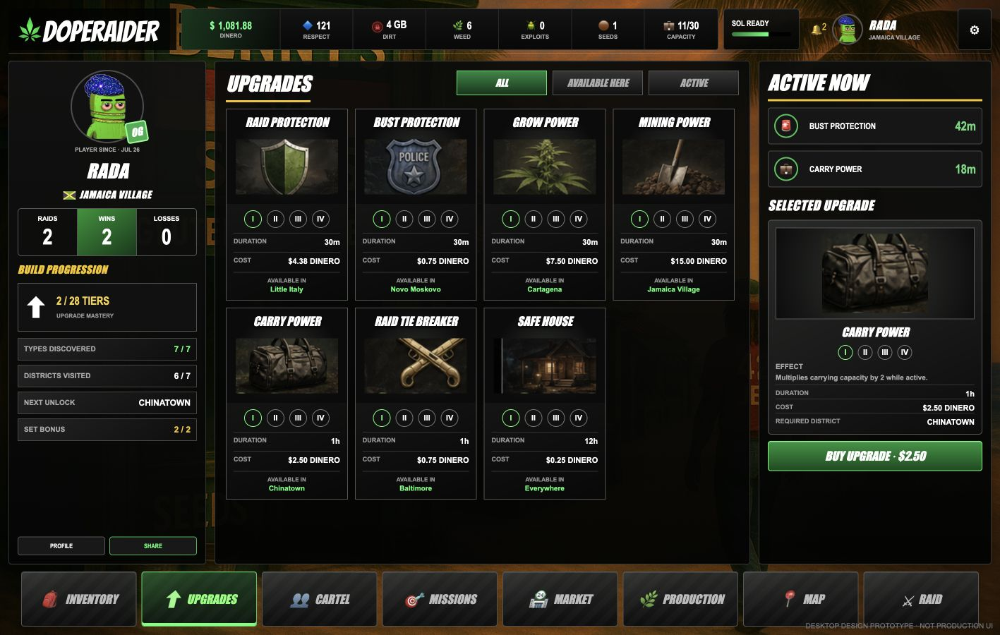

# Upgrades and Trophies

Upgrades are timed advantages purchased with Dinero. Every upgrade has four tiers. The selected tier sets its duration, price and—where applicable—its strength.

<figure><figcaption>
The desktop Upgrades screen shows all seven cards, four selectable tiers on each card, the required district and the selected card’s full details.
</figcaption></figure>

## How upgrades work

* There are seven upgrade types, each with **Tier I–IV**.
* Most upgrades are purchased only in their listed district. **Safe House** is available in every district.
* An active upgrade displays its tier and time remaining in the desktop HUD and on the relevant game screens.
* Buying an upgrade that is already active adds the new tier’s time to the existing timer and makes the newly selected tier the active tier.
* The prices below are shown in the game’s two-decimal Dinero format. The live upgrade card is the source of truth at purchase time.

## At a glance

| Upgrade | Buy it in | Core effect |
| --- | --- | --- |
| Raid Protection | Little Italy | Blocks incoming raids until you launch a raid yourself. |
| Bust Protection | Novo Moskovo | Removes the normal-route bust risk while it is active. |
| Grow Power | Cartagena | Doubles WEED yield and halves grow-job time. |
| Mining Power | Jamaica Village | Doubles DIRT yield and halves mining-job time. |
| Carry Power | Chinatown | Multiplies total carry capacity. |
| Raid Tie Breaker | Baltimore | Gives an edge when a raid ends in a weapon tie. |
| Safe House | Every district | Prevents incoming raids until it expires or player activity breaks cover. |

## Raid Protection

Buy Raid Protection in **Little Italy** when you need to hold product, Dinero or Respect without being selected as a raid target. It protects the holder from incoming raids. Starting a raid removes your own Raid Protection immediately.

| Tier | Duration | Cost | Effect |
| --- | --- | --- | --- |
| I | 30 minutes | $4.38 | Incoming raids are blocked. |
| II | 1 hour | $7.50 | Incoming raids are blocked. |
| III | 2 hours | $12.50 | Incoming raids are blocked. |
| IV | 4 hours | $22.50 | Incoming raids are blocked. |

## Bust Protection

Buy Bust Protection in **Novo Moskovo** before moving product on normal routes. While the timer is active, normal travel does not use the usual bust roll. It is protection for travel risk; it is not Raid Protection.

| Tier | Duration | Cost | Effect |
| --- | --- | --- | --- |
| I | 30 minutes | $0.75 | No bust on normal travel while active. |
| II | 1 hour | $1.38 | No bust on normal travel while active. |
| III | 2 hours | $2.50 | No bust on normal travel while active. |
| IV | 4 hours | $4.50 | No bust on normal travel while active. |

## Grow Power

Buy Grow Power in **Cartagena** before starting WEED production. All four tiers provide the same production effect; the higher tiers only extend the window. A grow job started while the upgrade is active produces **2× WEED** and takes **half of the normal grow time**.

| Tier | Duration | Cost | Effect |
| --- | --- | --- | --- |
| I | 30 minutes | $7.50 | 2× WEED yield; ½ grow-job time. |
| II | 1 hour | $13.75 | 2× WEED yield; ½ grow-job time. |
| III | 2 hours | $25.00 | 2× WEED yield; ½ grow-job time. |
| IV | 4 hours | $45.00 | 2× WEED yield; ½ grow-job time. |

## Mining Power

Buy Mining Power in **Jamaica Village** before starting DIRT production. As with Grow Power, the effect is constant across tiers and the duration increases with the tier. A mining job started while it is active produces **2× DIRT** and takes **half of the normal mining time**.

| Tier | Duration | Cost | Effect |
| --- | --- | --- | --- |
| I | 30 minutes | $15.00 | 2× DIRT yield; ½ mining-job time. |
| II | 1 hour | $28.75 | 2× DIRT yield; ½ mining-job time. |
| III | 2 hours | $50.00 | 2× DIRT yield; ½ mining-job time. |
| IV | 4 hours | $90.00 | 2× DIRT yield; ½ mining-job time. |

## Carry Power

Buy Carry Power in **Chinatown** before a large trade, production run or raid. It multiplies your maximum capacity for the full one-hour timer. The normal base capacity is 30, so the table shows both the multiplier and the resulting capacity from that base.

| Tier | Duration | Cost | Effect |
| --- | --- | --- | --- |
| I | 1 hour | $2.50 | 2× capacity: 30 → 60 (+30). |
| II | 1 hour | $5.00 | 3× capacity: 30 → 90 (+60). |
| III | 1 hour | $10.00 | 4× capacity: 30 → 120 (+90). |
| IV | 1 hour | $12.50 | 5× capacity: 30 → 150 (+120). |

Capacity covers what you are carrying and the output reserved by active production jobs. If your standard capacity changes, the same multiplier is applied to that current base instead.

## Raid Tie Breaker

Buy Raid Tie Breaker in **Baltimore** when you expect to fight other players. It applies when both players choose the same weapon: the active tie breaker decides the tie against a player without one. When both sides have a tie breaker, the desktop rule is higher tier first, then Respect if the tiers match. The tier value also increases the bonus Respect won from a successful raid.

| Tier | Duration | Cost | Effect |
| --- | --- | --- | --- |
| I | 1 hour | $0.75 | Tie-breaker active; +0 bonus Respect on a win. |
| II | 1 hour | $1.38 | Tie-breaker active; +1 bonus Respect on a win. |
| III | 1 hour | $1.88 | Tie-breaker active; +2 bonus Respect on a win. |
| IV | 1 hour | $2.50 | Tie-breaker active; +3 bonus Respect on a win. |

The tie breaker does not replace the weapon triangle. It only matters when the weapons tie.

## Safe House

Safe House can be bought in **any district**. It makes you unavailable as a raid target, but it is a hideout rather than a free shield: travel, buying or selling, production, collecting output, or launching a raid blows your cover and ends the protection.

| Tier | Duration | Cost | Effect |
| --- | --- | --- | --- |
| I | 12 hours | $0.25 | Incoming raids are blocked until activity breaks cover. |
| II | 24 hours | $0.38 | Incoming raids are blocked until activity breaks cover. |
| III | 3 days | $0.75 | Incoming raids are blocked until activity breaks cover. |
| IV | 7 days | $1.50 | Incoming raids are blocked until activity breaks cover. |

## Choosing the right upgrade

* Use **Bust Protection** and **Carry Power** together for a valuable multi-district route.
* Start production only after enabling **Grow Power** or **Mining Power**, so the whole job receives the boost.
* Use **Raid Protection** when you want to remain active without becoming raidable; use **Safe House** when you plan to go quiet.
* Pick **Raid Tie Breaker** for a raid session, not as a substitute for choosing the correct weapon.
* Check timer expiry before traveling or starting a job—the benefit is evaluated when the action happens.

## Trophies

Trophies record long-term progression rather than timed advantages.

| Trophy | What it tracks |
| --- | --- |
| RAIDER | Successful raids completed. |
| GROWER | WEED grows completed. |
| MINER | DIRT mining completed. |
| DEALER | WEED sales completed. |
| TRAVELLER | Districts traveled. |
| VICE | Travel to Vice Island. |
| COMPETITOR | Competition wins. |

## Respect

Respect is DopeRaider’s reputation score. It is earned through active play and is used for progression, leaderboards, boss competition and raid decisions where players are otherwise tied. High Respect makes a player more prominent—and often a more attractive target.
