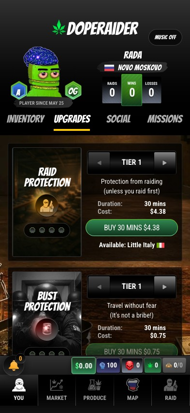
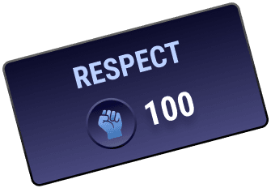

# Upgrades and Trophies

Upgrades create temporary windows of advantage. Trophies and Respect show what you have survived long enough to earn.

<figure><figcaption>
Upgrades are timed tools. Buy them when the next move can pay for them.
</figcaption></figure>

## Upgrade Types

| Upgrade | Role | Best Used For |
| --- | --- | --- |
| Raid Protection | Defense against raids | Holding value, recovering after a score, moving through busy districts. |
| Bust Protection | Defense against travel busts | Carrying product between districts. |
| Grow Power | WEED production boost | Timed grow sessions and home-district production bursts. |
| Mining Power | DIRT production boost | Mining DIRT faster and improving output. |
| Carry Power | Bigger inventory | High-volume trading, jackpot recovery, larger production cycles. |
| Raid Tie Breaker | Raid tie advantage | Aggressive raid windows and Respect fights. |
| Safe House / Hideout | Temporary safety | Going quiet, protecting inventory, waiting out danger. |

## DIRT-Side Naming

The DIRT lore gives several upgrades a cyber-facing skin:

| System | DIRT-Side Flavor |
| --- | --- |
| Bust Protection | Encryption |
| Raid Protection | Firewall |
| Carry Power | Carry capacity |
| Production Power | Mining Power |

The underlying mechanics stay readable. The fantasy changes by product.

## Timing Matters

Upgrades expire. Buying protection too early wastes duration. Buying it too late means the damage already happened.

Use upgrades when:

* your inventory is worth defending
* your route is profitable enough to justify the fee
* a production boost can be fully used before it expires
* you are about to raid multiple targets
* you need to sell down jackpot inventory safely

## Trophies

Trophies track long-term mastery across the game.

| Trophy | What It Tracks |
| --- | --- |
| RAIDER | Successful raids completed. |
| GROWER | WEED grows completed. |
| MINER | DIRT mining completed. |
| DEALER | WEED sales completed. |
| TRAVELLER | Districts traveled. |
| VICE | Travel to Vice Island. |
| COMPETITOR | Competition wins. |

<figure><figcaption>
Respect is the social scoreboard and the boss ladder.
</figcaption></figure>

## Respect

Respect is earned through active play: production, travel, raids, bust events, missions, and other progression hooks. It affects reputation, leaderboards, boss competition, and tie situations.

Players with high Respect become targets, but they also become dangerous to challenge.

## Progression Strategy

* Producers should stack production trophies while watching carry limits.
* Traders should build travel history and profit discipline.
* Raiders should avoid empty hits and focus on high-value timing.
* Boss candidates should build Respect in their home district and defend reputation.

Progression is not just grinding. It is proof that your strategy survived contact with the street.
